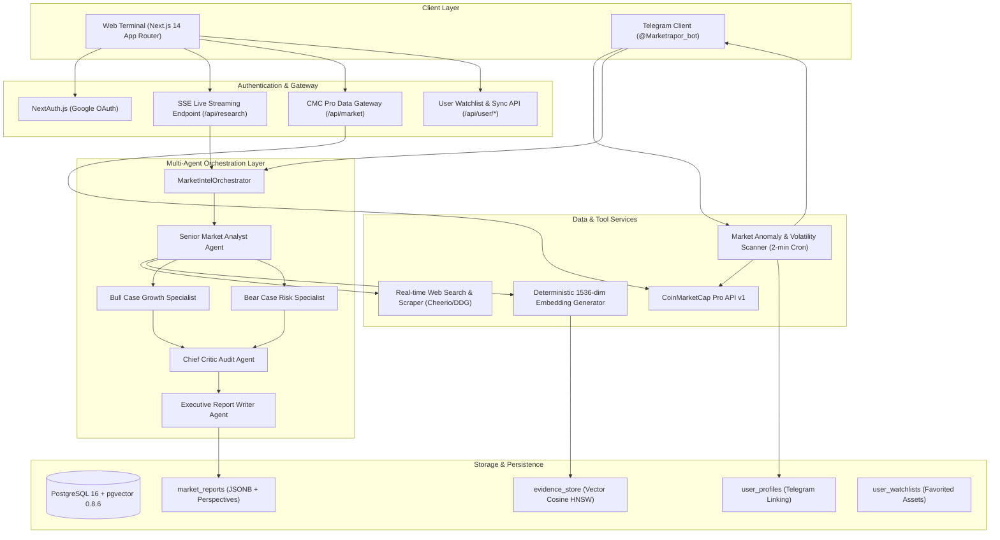
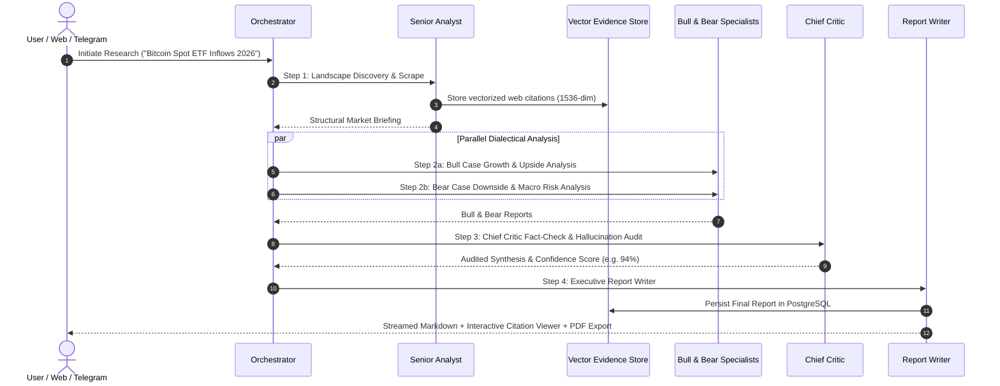

# 🌐 Market Intelligence OS — Architecture & System Design Document

**Market Intelligence OS** is an autonomous, multi-agent crypto & financial market research, live asset screening, and executive intelligence reporting platform.

---

## 🏛️ 1. High-Level Architecture



---

## 🧩 2. Multi-Agent Pipeline Flow

The research pipeline executes in a multi-stage ReAct loop with audit synthesis:



---

## 🗄️ 3. Database Schema (`PostgreSQL + pgvector`)

### 1. `evidence_store`
Stores vectorized evidence chunks, citations, and source snippets.
- `id` (UUID, Primary Key)
- `title` (TEXT)
- `url` (TEXT)
- `source` (TEXT)
- `snippet` (TEXT)
- `content` (TEXT)
- `tags` (TEXT[])
- `embedding` (`vector(1536)` indexed via HNSW cosine distance `<=>`)
- `created_at` (TIMESTAMP)

### 2. `market_reports`
Stores validated institutional reports with audit trails.
- `id` (UUID, Primary Key)
- `task_id` (VARCHAR)
- `title` (TEXT)
- `query` (TEXT)
- `summary` (TEXT)
- `content` (TEXT)
- `perspectives` (`JSONB` — Analyst, Bull, Bear)
- `critique` (`JSONB` — Critic Audit & Verification Score)
- `created_at` (TIMESTAMP)

### 3. `user_profiles`
Stores user settings and Telegram chat links.
- `id` (SERIAL, Primary Key)
- `email` (VARCHAR, Unique)
- `name` (VARCHAR)
- `image` (TEXT)
- `telegram_chat_id` (BIGINT, Unique)
- `link_token` (VARCHAR(64), Unique)
- `link_token_expires_at` (TIMESTAMP)

### 4. `user_watchlists`
Stores user-pinned asset trackers.
- `id` (SERIAL, Primary Key)
- `user_email` (VARCHAR)
- `symbol` (VARCHAR)
- `created_at` (TIMESTAMP)
- Unique constraint on `(user_email, symbol)`

---

## 📦 4. Monorepo Structure

```
market-intelligence/
├── apps/
│   ├── web/                     # Next.js 14 App Router Terminal UI
│   │   ├── src/app/             # Dashboard, Asset details, Research viewer, Auth
│   │   ├── src/components/      # TradingView Candlesticks, Watchlist, Modals
│   │   └── src/lib/             # CMC Gateway, PDF Export, User & Auth Services
│   │
│   └── telegram-bot/            # Grammy Bot Daemon (@Marketrapor_bot)
│       └── src/
│           ├── index.ts         # /report, /status, /link commands & Cron
│           └── alertEngine.ts   # 2-min CMC Anomaly Scanner & Push Dispatcher
│
├── packages/
│   ├── core/                    # LLM abstractions, ReAct BaseAgent, Tools
│   ├── agents/                  # Multi-Agent Personas & Orchestrator
│   └── tools/                   # pgvector DB Pool, Evidence Store, Scraper
│
├── docker/
│   └── init.sql                 # Vector extensions, schemas, & HNSW indexes
├── docker-compose.yml           # Local PostgreSQL 16 + pgvector container
└── ARCHITECTURE.md              # System Architecture & Technical Specifications
```

---

## ⚡ 5. Key Features

1. **Autonomous Multi-Agent Workflow:** 5 specialized agents working sequentially and in parallel to eliminate single-LLM bias and hallucination.
2. **Real-time Financial Data Feed:** Direct integration with CoinMarketCap Pro API for global macro stats and live top 50 screener.
3. **Interactive High-Density Terminal:** TradingView Lightweight Charts (v5 OHLCV + Volume), Recharts Multi-Asset Matrix, and live SSE research progress stepper.
4. **Corporate PDF Export:** Single-click branded PDF export with A4 pagination.
5. **Real-Time Market Anomaly Engine:** Background cron that detects 3%+ hourly surges and pushes instant Telegram alerts to linked users.
6. **Cross-Platform Account Sync:** One-time verification token linking web accounts with Telegram chat IDs.
