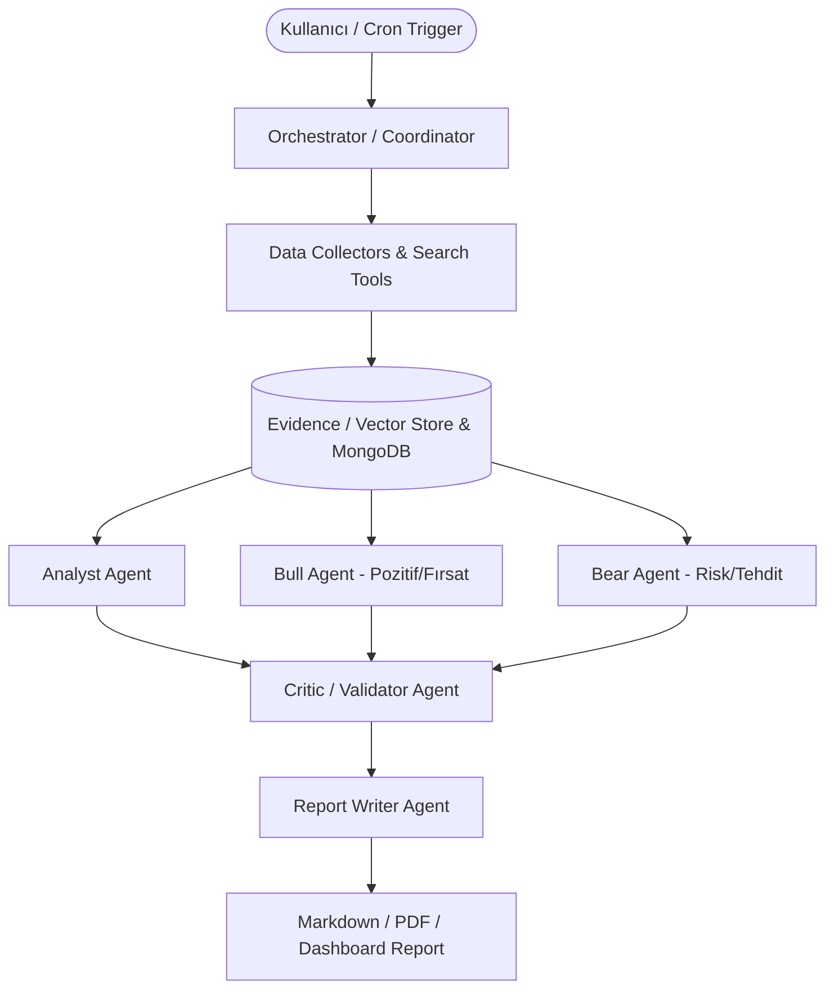

# AI/ML Market Intelligence Multi-Agent Auto-Reporting: Step-by-Step Learning & Implementation Guide

Bu rehber, **Market Intelligence (Pazar İstihbaratı ve Otomatik Raporlama)** sistemini sıfırdan, adım adım ve her aşamada mimariyi öğrenerek inşa etmemiz için hazırlanmıştır.

---

## 🎯 Nihai Hedef ve Sistem Mimarisi

Sistem; web/haber/finans kaynaklarından veri toplayan, farklı perspektiflerde (Boğa/Ayı/Analist) yorumlayan, eleştiren ve yöneticiler için otomatik pazar raporları üreten çoklu ajan (Multi-Agent) mimarisidir.

---

## 📚 Temel Kavramlar Sözlüğü (Phase 0: Fundamentals)

Geliştirmeye başlamadan önce bilmemiz gereken temel yapı taşları:

1. **Agent (Ajan):** Belirli bir rolü, hafızası (Memory), hedefleri ve araçları (Tools) olan bağımsız LLM birimi.
2. **Role (Rol):** Ajanın sistemdeki görevi, uzmanlık alanı ve perspektifi (Örn: *Bull Agent*, *Risk Denetçisi*).
3. **Action (Eylem):** Ajanın gerçekleştirdiği tekil işlem (Örn: `SearchWeb`, `SummarizeMetrics`, `ExtractEntities`).
4. **Task (Görev):** Bir veya birden fazla eylemi içeren iş birimi.
5. **Message & Event Bus:** Ajanların birbirleriyle veri ve durum paylaştığı iletişim kanalı.
6. **Memory (Hafıza):** 
   - *Short-term:* Mevcut iş akışındaki bağlam (context window).
   - *Long-term:* Vektör veritabanı / MongoDB üzerindeki geçmiş bilgi ve kanıtlar.
7. **Tool (Araç):** Ajanların dış dünya ile etkileşime girdiği fonksiyonlar (Web scraping, DuckDuckGo/Tavily search, MongoDB sorguları).
8. **Evidence Store (Kanıt Deposu):** Halüsinasyonları önlemek için toplanan ham kaynaklar, alıntılar ve metriklerin tutulduğu yapı.
9. **Critic / Reflection:** Üretilen analizin tutarlılığını, kaynak doğruluğunu ve mantıksal hatalarını denetleyen mekanizma.
10. **Orchestrator (Orkestratör):** Ajanların sırasını (Sequential), paralel çalışmasını veya döngüsel düzeltmelerini yöneten şef modül.

---

## 🗺️ Adım Adım Geliştirme Yol Haritası (Roadmap)

### 📌 Aşama 1: Monorepo & Proje Altyapısının Kurulması
- [x] **Adım 1.1:** Monorepo yapısının oluşturulması (`pnpm workspace`, TypeScript, monorepo mimarisi).
- [x] **Adım 1.2:** Ortak paketlerin (`@market-intel/core`, `@market-intel/tools`, `@market-intel/agents`) yapılandırılması.
- [x] **Adım 1.3:** PostgreSQL (Docker) & pgvector (Vektör İndeksleri & Evidence Store) bağlantılarının kurulması.

---

### 📌 Aşama 2: Temel Agent Runtime & LLM Entegrasyonu (Core Engine)
- [x] **Adım 2.1:** `BaseAgent`, `Role`, `Action` ve `Message` sınıflarının TypeScript ile yazılması.
- [x] **Adım 2.2:** DeepSeek API (OpenAI uyumlu) LLM adaptörü ve Zod tabanlı Structured Output altyapısı.
- [x] **Adım 2.3:** Tool Entegrasyon Motoru (ReAct döngüsü, Tool Calling & ToolRegistry).

---

### 📌 Aşama 3: Veri Toplama & Evidence Store (Data Ingestion)
- [x] **Adım 3.1:** Web Arama ve Scraping Araçları (`search_web`, `extract_page_content`).
- [x] **Adım 3.2:** Evidence Store: Metin parçalama (chunking), embedding çıkarımı ve PostgreSQL/pgvector veritabanına kayıt.
- [x] **Adım 3.3:** Kaynak doğrulama, alıntılama (Citation) ve benzerlik araması altyapısı.

---

### 📌 Aşama 4: Uzman Ajanların İnşası (Specialized Agents)
- [x] **Adım 4.1:** **Analyst Agent:** Ham verilerden temel trendleri, metrikleri ve pazar hareketlerini çıkaran analist.
- [x] **Adım 4.2:** **Bull Agent (Fırsat/Büyüme):** Sektördeki fırsatları, büyüme potansiyellerini ve pozitif sinyalleri savunan ajan.
- [x] **Adım 4.3:** **Bear Agent (Risk/Tehdit):** Riskleri, rekabet tehditlerini, regülasyon engellerini savunan ajan.
- [x] **Adım 4.4:** **Critic Agent (Denetleyici):** Bull ve Bear tezlerini çarpıştıran, kanıtları teyit eden ve çelişkileri tespit eden hakem ajan.

---

### 📌 Aşama 5: Orkestrasyon & Otomatik Rapor Üretimi & Telegram Bot
- [x] **Adım 5.1:** State Machine / Workflow Runner: Ajanların sıralı ve paralel yürütülmesi (`MarketIntelOrchestrator`).
- [x] **Adım 5.2:** **Report Writer Agent:** Tüm analizleri birleştirip yönetici özeti ve detaylı Markdown raporu oluşturan ve PostgreSQL'e kaydeden modül.
- [x] **Adım 5.3:** **Telegram Bot Uygulaması (`apps/telegram-bot`):** İnteraktif `/rapor`, `/ornek` komutları ve `node-cron` ile zamanlanmış otomatik raporlama.

---

### 📌 Aşama 6: Dashboard & Görselleştirme (Next.js, Tailwind, shadcn/ui & Roboto)
- [x] **Adım 6.1:** Roboto + shadcn/ui + Next.js App Router ile Finansal Araştırma Terminali (`apps/web`).
- [x] **Adım 6.2:** Screener/Watchlist, Varlık Detayı (`/dashboard/assets/[symbol]`), AI Market Insights, Sentiment Analizi, Çoklu-Ajan Aktivite Akışı ve İnteraktif Rapor / Citation Görüntüleyici (`/dashboard/research/[id]`).

---

## 🚀 Şimdi Nereden Başlıyoruz?

Her adımda önce teorisini/mantığını inceleyip ardından kodunu yazacağız.

1. **Adım 1:** Monorepo yapısı ve klasör hiyerarşisinin (`packages/core`, `packages/agents`, `apps/api`) `pnpm` ile oluşturulması.
2. Hazır olduğunuzda ilk adım için başlayabiliriz!
