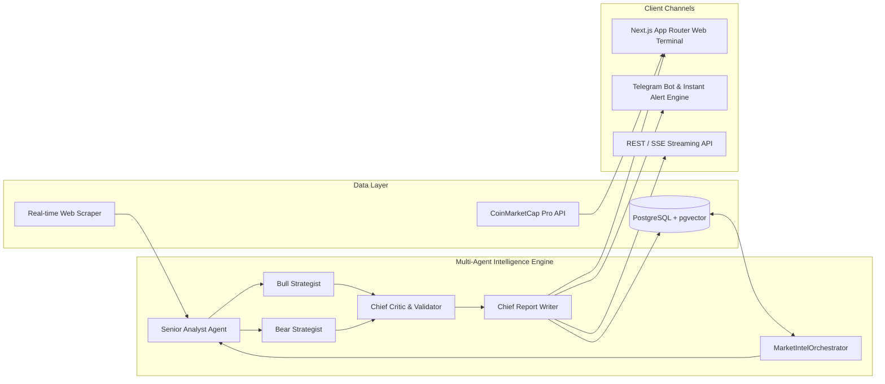

# Market Intelligence OS — Production & Commercialization Roadmap

Bu doküman, **Market Intelligence OS (Coin & Financial Multi-Agent Intelligence Terminal)** projesinin MVP aşamasından çıkıp ticari, ölçeklenebilir ve üretime hazır (Production-Ready SaaS) bir ürün haline gelmesi için gereken tüm adımları içerir.

---

## 🏗️ (Current Core Architecture)

---

## 🗺️ Adım Adım Production Yol Haritası (Production Steps)

### 📌 Aşama 1: Web Üzerinden Canlı Araştırma Başlatma & Streaming UI (Interactive Research Session)
- [ ] **Adım 1.1:** Web API Rotaları (`/api/research` POST & GET) ve Server-Sent Events (SSE) ile anlık ajan ilerleme yayını.
- [ ] **Adım 1.2:** Web Arayüzünde **"Start New Research"** modülü: Konu/Varlık girildiğinde ajanların canlı stepper/status akışı (`Analyst` ➔ `Bull/Bear` ➔ `Critic` ➔ `Report Writer`).
- [ ] **Adım 1.3:** PostgreSQL'deki `market_reports` tablosundan gerçek raporların web listesinde ve `/dashboard/research/[id]` sayfasında dinamik gösterilmesi.

---

### 📌 Aşama 2: Gelişmiş Finansal Grafikler & Canlı Varlık Detayı (Financial Charts & Analytics)
- [x] **Adım 2.1:** **TradingView Lightweight Charts** (OHLCV Mum/Candlestick grafikleri, Hacim göstergeleri, Zaman dilimleri: 1D, 7D, 1M, 1Y).
- [x] **Adım 2.2:** Varlık detay sayfasında (`/dashboard/assets/[symbol]`) CMC'den canlı piyasa, fiyat ve likidite verileri.
- [x] **Adım 2.3:** Varlık Karşılaştırma Matrisi (Recharts ile BTC vs ETH vs SOL vs AVAX çoklu performans kıyaslama grafiği ve metrik tablosu).

---

### 📌 Aşama 3: Kullanıcı Yönetimi & Çoklu Kiracılık (Authentication & User Workspace)
- [x] **Adım 3.1:** **NextAuth.js (Google OAuth):** App Router API rotası (`/api/auth/[...nextauth]`), Header kullanıcı durumu, giriş/çıkış butonları ve `/login` sayfası.
- [x] **Adım 3.2:** Kullanıcıya özel Watchlist (favori coinler/varlıklar) ve özel Araştırma Geçmişi (User History) veritabanı şeması (`user_watchlists` ve `user_profiles`).
- [x] **Adım 3.3:** Telegram Bot ile Web Hesabını Eşleştirme (`/link <token>` ile Telegram uyarılarını web kullanıcısına bağlama).

---

### 📌 Aşama 4: Rapor Dışa Aktarma & Otomasyon Dağıtımı (Export & Automation)
- [x] **Adım 4.1:** **PDF Export:** Tek tıkla kurumsal formatta markalı PDF Pazar Raporu indirme (`jspdf` + `html2canvas` ve yüksek çözünürlüklü A4 sayfalama).
- [x] **Adım 4.2:** **Fiyat & Anomali Alarmları:** CMC'de %5+ ani volatilite veya hacim patlaması olduğunda Telegram + Web push bildirimi (otonom arka plan tarayıcısı).

---

###this one later 

### 📌 Aşama 5: Ödeme & Fiyatlandırma Modeli (Monetization & Subscriptions)
- [ ] **Adım 5.1:** **Stripe** veya **LemonSqueezy** abonelik entegrasyonu.
- [ ] **Adım 5.2:** Katmanlı Paket Yapısı (Tiering):
  - **Free:** Canlı CMC Screener + 3 AI Raporu / Ay.
  - **Pro ($49/ay):** Sınırsız AI Multi-Agent Raporlama, Canlı Telegram Bot Alarmları, PDF İndirme.
  - **Institutional ($199/ay):** Özel API Erişimi, Özel LLM / Vektör Evidence Store, 7/24 Özel Portföy Takibi.

---

### 📌 Aşama 6: Dağıtım, Güvenlik & CI/CD (Production Deployment)
- [x] **Adım 6.1:** Docker Compose ve Production Dockerfile yapılandırması (`apps/web/Dockerfile`, `apps/telegram-bot/Dockerfile`, `docker-compose.yml`, `.dockerignore`).
- [ ] **Adım 6.2:** Database pg and pg vector 
- [ ] **Adım 6.3:** vps deploy
